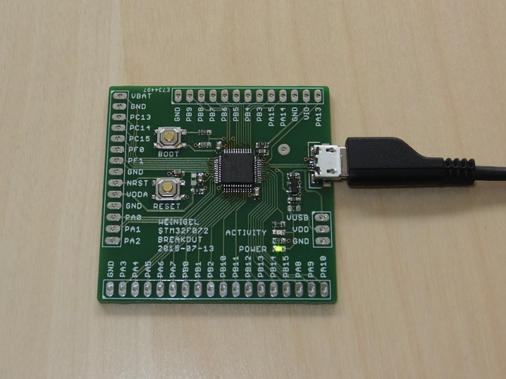

STM32F072 Breakout Board
========================

This is a small breakout board for the STM32F072 MCU in a LQFP48
package.  I wanted something that would make it easier to try things
out with a small STM2F07 MCU and this PCB is the result.  This PCB
should also work with the STM32F042 MCU and maybe even other STM MCUs
in the same package, but I have not tested that.

Features
--------

* A Micro USB for powering the board and communicating with a host

* All other I/O pins are routed to a 2.54mm pin header

* A voltage regulator which provides VDD

* VIO and VDDA are normally provided from VDD via 0Ω resistors, but
  can optionally be provided externally via a pin header

* RESET and BOOT buttons

* A power LED which shows when the PCB is powered

* A user programmable LED which is connected to I/O pin PA10 (optional)

* PCB is 2 layers and smaller than 50x50mm and so ordering from China
  will only cost about $10 + shipping for 10 PCBs.

Firmware
========

A firmware based on [ChibiOS-RT](http://www.chibios.org/) can be found
on [GitHub](https://github.com/wingel/chibios-stm).

License
=======

[stm32f072-breakout](https://github.com/wingel/stm32f072-breakout) by
[Christer Weinigel](mailto:christer@weinigel.se) is licensed under a
[Creative Commons Attribution 4.0 International
License](http://creativecommons.org/licenses/by/4.0/).

The intent is to make this PCB available to anyone that finds it
useful as long as I get credit for the original design.  If you want
to use the design and have issues with the above license, please
contact me.

